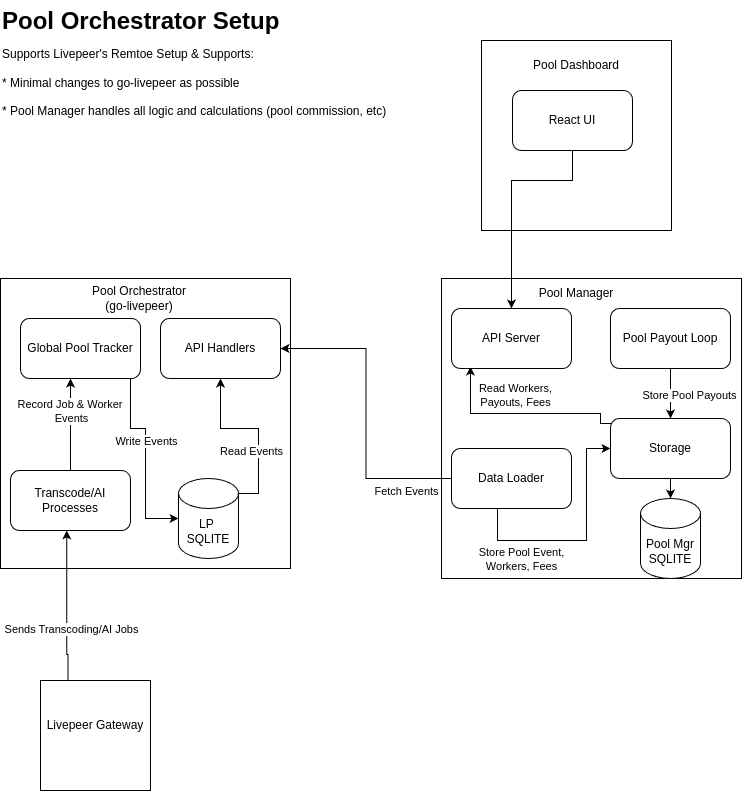

# openpool-manager

## Overview

TODO: write up an overview.

potental topics:
- why Open Pool? 
  - to unify all pool development to focus on a clean and simple way to manage the pool software
  - allow for custom pool implementations without sacrificing the cost of managing go-livepeer forks
  - potentially merge pool software into core go-livepeer to eliminate any forking.
  - leverage a plugin approach to enable customizations

## Pool Manager Components

All of these components are still in development. 

The most basic features of Open Pool Stack: 
* Allow ETH address for Remote Node
* Track Remote Node pending and paid balances
* Track Remote Node connection status (online/offline)

see [figure 1](#figure-1) for the architecture diagram of the components

### Data Loader

This layer is responsible for fetching pool events from the go-livepeer orchestrator. It will read all the events over time and keep a locally updated "state" of pool data.

The key data captured is the "Remote Worker". The remote worker has an ETH Address, status (offline/online), pending fee balance and paid fee balance.    

#### Data Loader Plugin

This module uses a go plugin system to allow pool orchestrators to run different logic for fetch and load pool data.

2 basic plugins are being worked on:
1. "demo only" in memory only basic example plugin.
2. SQLite Plugin that fetches all Orchestrator events and stores them in a sqlite table **remote_worker** (using the [GORM](https://gorm.io/) Object Relation Mapping Framework)  

## Pool Payout Loop

A simple background task that looks at all the remote workers and checks if their pending fees meet a configurable minimum payout threshold.

If the remote worker does, then the ETH payout will be sent and a sqlite **pool_payout** record will be recorded. The remote_worker pending and paid fees will be updated accordingly.

If the remote worker does not, the loop will skip them until their ready for payout. 

### API Server

This is a standard Go server (uses [Gin Http Framework](https://gin-gonic.com/)). 
The API Server currently supports `/status` and `/transcoder` endpoints.

### Storage
a storage abstraction was created to allow for multiple approaches to storing pool data (supporting in-memory and sqlite) .  

This may or may not be in the final release, but there are experiments to see if  storage, data loading, api and pool payouts would use a plugin style. 
These experiments need more tinkering before finalized. Implementing multiple pools will help with this experiment. Possible pool candiates:

1. Open Pool formerly Compute Node is the first experiment.
2. Livepeer Grant Node Pool will be a basic clone of Open Pool but will need modification to prevent poor performing node workers from tanking the entire pool.
3. Video Miner Pool - a good deal of customization are here and will certainly help flush out the plugin system.
4. Titan Node Pool - Not sure what is involved here, may not be worth the effort.

## Modificaton to go-livepeer

* supports eth address from remote worker
* added the Global Event Tracker
  * new DB table for pool_events
  * queries to create and find by "last check time"
* publishes the following events:
  * orchestrator-reset
  * worker-connected
  * worker-disconnected
  * job-processed (AI and Transcoding) - All fees and price data captured with this event. For transcoding, the worker eth address is present. AI jobs have the request ID not ETH address.
  * job-received (AI Only) - This links the received job to the process job to allow "correlation" by request ID. This is due to a limitation of how AI Jobs get paid.
* all events use "computeUnits" and "pricePerComputeUnit" - the values are in wei. The underlying compute unit in go-livepeer is pixels.
* added "poolEventsHandler" to allow Pool Managers to pull event data from livepeer periodically.
  * the API uses "last check time" to only fetch events since the last check.

* Minor Clean is needed
  * still some testing logic in the application. places that events were tested but not used. 
  * The ethereum address capturing logic could be simplified / cleaned up.
  * double check error handling and logging

# References

## Figure 1

## Figure 2
